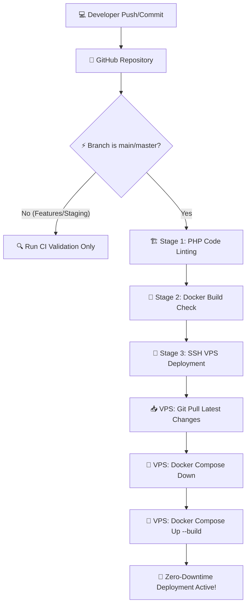
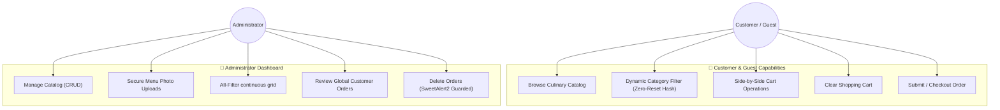

# 🌟 Five Star Restaurant - Premium Culinary & CRUD Platform

Welcome to the **Five Star Restaurant** web application, a production-grade, highly optimized PHP-native OOP/MVC platform. It is engineered with a luxurious dark-themed Jade & Obsidian aesthetic, dynamic client-side caching/filtering systems, full Dockerized container containers, and a secure automated **GitHub Actions CI/CD pipeline** with self-hosted runner support and automated VPS deployment.

---

## ✨ Features & Capabilities

### 👑 Premium Luxury User Experience
*   **Harmonious HSL Palettes**: Stunning Jade Green and Deep Obsidian Dark themes highlighted with delicate Terracotta (`#C1603A`) micro-accents.
*   **Sleek Glassmorphic Components**: Soft frosted glass panels, gorgeous CSS transitions, and smooth hover effects that bring the catalog to life.
*   **Global Custom Alerts**: Theme-aware, customized **SweetAlert2** modals and toast notifications, replacing generic browser popups for a premium native app feel.
*   **Navbar Menu-Cart Alignment**: Restructured menu items positioning the shopping cart right next to the Catalog to optimize the e-commerce check-out loop.

### 🛒 E-Commerce & Dynamic Navigation
*   **Zero-Reset Dynamic Filtering**: Client-side hash-based catalog filtering (`#seafood`, `#chicken`, etc.) that preserves active category groups on addition to carts or page reloads.
*   **Admin Mode ALL Toggle**: Clean continuous catalog grids for admins with automatic hide-headers triggers in "ALL" mode, transitioning back to clear categorizations on specific filters.
*   **One-Click Cart Cleansing**: Securely empty shopping carts with a SweetAlert2 modal safety check and dedicated custom dispatch routing handlers.

### ⚙️ Elite Operations & Security
*   **Zero-Hardcode Infrastructure**: All external host ports, database credentials, internal ports, and project tags are decoupled into a dynamic `.env` configuration file.
*   **Secured File Upload System**: Dynamic recursive folder validation (`0777` permissions) guaranteeing smooth, error-free product image additions without permission warning flags.
*   **Automated Self-Healing DB Seed**: Embedded database updates that automatically migrate legacy administrator credentials to new credentials upon startup.

---

## 🛠️ Technology Stack

*   **Core Logic**: Pure PHP Native OOP (Model-View-Controller) Architecture.
*   **Styling System**: CSS Grid & Flexbox, custom Tailwind-alternative luxury tokens, Bootstrap 5 (Navbar only).
*   **Database engine**: MySQL 8.0 with transactional PDO connections.
*   **Virtualization**: Docker & Docker Compose orchestration.
*   **DevOps & Automation**: GitHub Actions (Self-Hosted Runner & SSH Automated VPS Deployment).

---

## 🚀 Quick Start (Local Development)

### 1. Prerequisite Installations
*   Ensure you have [WSL2 (Ubuntu)](https://learn.microsoft.com/en-us/windows/wsl/install) and [Docker Desktop](https://www.docker.com/products/docker-desktop/) installed on your machine.

### 2. Setting Up Environment Variables
Copy and create the `.env` file in the root directory:
```bash
# Create local .env file
cp .env.example .env || touch .env
```
Populate your `.env` file with the following standard configurations:
```env
# Docker Project Configuration
COMPOSE_PROJECT_NAME=fiverst

# Database Configuration
DB_HOST=db
DB_NAME=fiverst
DB_USER=root
DB_PASS=rootpassword
DB_PORT=3306

# Exposed Host Ports
WEB_PORT=8085
DB_HOST_PORT=3309

# Cloudflare Configuration
CLOUDFLARE_TOKEN=your_cloudflare_tunnel_token
```

### 3. Launching the App
Spin up your containers from the root directory:
```bash
# Spin up services in background with a fresh build
docker compose up -d --build
```
Your services will be launched:
*   **Web Application**: Accessible at `http://localhost:8085`
*   **Database (External port)**: `127.0.0.1:3309`

### 4. Admin Credentials
*   **Email**: `admin@gmail.com`
*   **Password**: `admin123`
*   **Full Name**: `Admin`

---

## 🌐 Production CI/CD Deployment

This repository is integrated with a continuous integration and deployment pipeline inside `.github/workflows/ci.yml`.

### 1. CI Phase: Automatic Lint & Build Testing
Runs on every push to check for:
*   **PHP Syntax Check**: Scans all controllers and views in parallel using `xargs -P 4 php -l` to prevent compilation errors.
*   **Docker Build Validation**: Pre-builds containers inside the virtual runner (`docker compose build`) to guarantee build integrity.

### 2. CD Phase: Zero-Downtime Deployment to VPS
Deploys automatically upon pushes to the `main` or `master` branch:
1.  Connects securely to your VPS via SSH (`appleboy/ssh-action`).
2.  Navigates to `/home/fadlan/fiverst`.
3.  Pulls the latest code updates (`git pull`).
4.  Re-builds and refreshes containers silently (`docker compose down && docker compose up -d --build`).

### 3. Required GitHub Secrets
To make the CD stage functional, register the following parameters in your repository **Settings** ➔ **Secrets** ➔ **Actions**:
*   `VPS_HOST`: Public IP of your production VPS.
*   `VPS_USERNAME`: SSH Username (e.g. `fadlan`).
*   `VPS_SSH_KEY`: Private SSH Key (from `~/.ssh/id_rsa`).
*   `VPS_PORT`: SSH access port (typically `22`).

---

## 📊 System Flowchart & Use Case Diagrams

### 1. CI/CD Deployment Flowchart
This diagram illustrates the automated Continuous Integration and Continuous Deployment pipeline logic powered by GitHub Actions:



### 2. User & Admin Roles Use Case
This diagram defines the functional permissions and capabilities mapped to each operational role in the platform:



---

## 📂 Project Architecture

```plaintext
├── app/
│   ├── Config/       # Database connections & self-healing setups
│   ├── Controllers/  # Route controllers (Admin & User workflows)
│   ├── Core/         # Dispatch routing engines
│   ├── Models/       # PDO database queries (Products & Orders)
│   └── Views/        # Jade & Obsidian themed visual layouts
├── assets/
│   ├── css/          # High-premium custom aesthetic tokens
│   ├── upload/       # Dynamic uploaded product images (Gitignored)
│   └── js/           # SweetAlert2 & Filtering engines
├── .github/          # GitHub Actions CI/CD configurations
├── .gitignore        # Excludes sensitive items (.env, dynamic images)
├── Dockerfile        # PHP-Apache container settings
├── docker-compose.yml# Container orchestration manifest
└── fiverst.sql       # Database schema seeds
```

---
*Crafted with 💖 for high-performance deployment systems by Fadlan Achmad F.*
